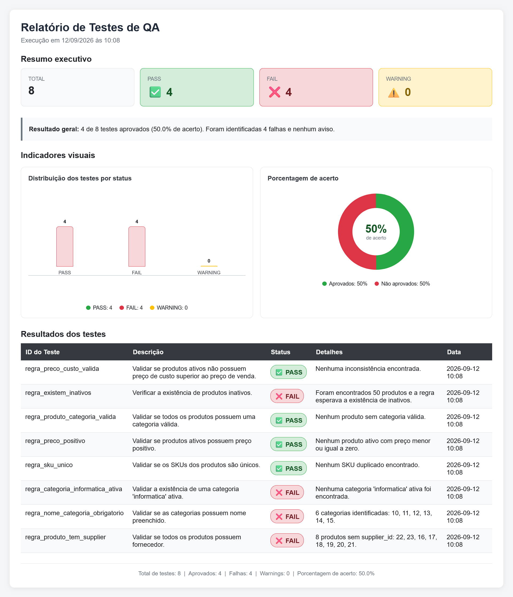
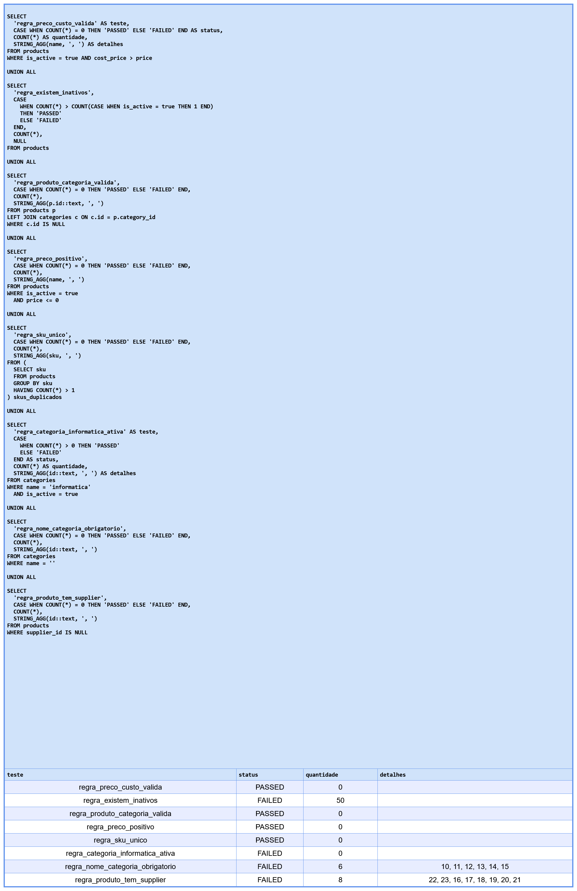

# Relatório de Execução --- Suíte de Testes SQL

> **Projeto:** SQL & Banco de Dados para QA\
> **Banco:** Supabase Northwind (PostgreSQL)\
> **Data de execução:** 2026-09-12 (10:08)\
> **Executado por:** Jackson Mendes\
> **Script:** `aula49-2-rascunho.sql`

------------------------------------------------------------------------

## 📊 Resultado Consolidado

| \#  | Teste                              | Status     | Qtd | Detalhes                          |
|-----|------------------------------------|------------|-----|-----------------------------------|
| 01  | `regra_preco_custo_valida`         | ✅ PASSED  | 0   | ---                               |
| 02  | `regra_existem_inativos`           | ❌ FAILED  | 50  | ---                               |
| 03  | `regra_produto_categoria_valida`   | ✅ PASSED  | 0   | ---                               |
| 04  | `regra_preco_positivo`             | ✅ PASSED  | 0   | ---                               |
| 05  | `regra_sku_unico`                  | ✅ PASSED  | 0   | ---                               |
| 06  | `regra_categoria_informatica_ativa`| ❌ FAILED  | 0   | ---                               |
| 07  | `regra_nome_categoria_obrigatorio` | ❌ FAILED  | 6   | IDs: 10, 11, 12, 13, 14, 15      |
| 08  | `regra_produto_tem_supplier`       | ❌ FAILED  | 8   | IDs: 22, 23, 16, 17, 18, 19, 20, 21 |

**Evidência da execução completa** 


> *Figura 1 - Output completo da suite executada no DBeaver*

## ✅ Testes que Passaram (4/8)

Todos os 4 testes abaixo retornaram **PASSED** --- regras de negócio respeitadas.

| Teste                            | O que valida                                      |
|----------------------------------|---------------------------------------------------|
| `regra_preco_custo_valida`       | Nenhum produto ativo com `cost_price > price`     |
| `regra_produto_categoria_valida` | Todos os produtos têm categoria válida            |
| `regra_preco_positivo`           | Nenhum produto ativo com preço zero ou negativo   |
| `regra_sku_unico`                | Nenhum SKU duplicado no banco                     |

------------------------------------------------------------------------

## ❌ Testes que Falharam (4/8)

### 🐞 BUG-001 --- `regra_existem_inativos`

**Título:**\
`[DATABASE] Ausência de produtos inativos (soft delete)`

**Critério Avaliado:**\
O banco deve possuir produtos inativos (`is_active = false`) para validar o funcionamento do soft delete.

**Premissa/Entendimento:**\
A regra espera a existência de produtos inativos. Se todos os produtos estiverem ativos, a regra falha.

**Defeito:**

1. Não foram encontrados produtos inativos (ou a contagem não atendeu à condição esperada).
2. Resultado obtido: **FAILED** --- 50 registros retornados pela query.

**Evidência:** resultado do assert da execução no DBeaver / relatório HTML.

------------------------------------------------------------------------

### 🐞 BUG-002 --- `regra_categoria_informatica_ativa`

**Título:**\
`[DATABASE] Categoria 'informatica' não encontrada ou inativa`

**Critério Avaliado:**\
Deve existir ao menos uma categoria com `name = 'informatica'` e `is_active = true`.

**Premissa/Entendimento:**\
A categoria "informatica" é necessária para fluxos de negócio e navegação da loja.

**Defeito:**

1. Nenhuma categoria `informatica` ativa foi encontrada.
2. Resultado obtido: **FAILED** --- quantidade = 0.

**Evidência:** resultado do assert da execução no DBeaver / relatório HTML.

------------------------------------------------------------------------

### 🐞 BUG-003 --- `regra_nome_categoria_obrigatorio`

**Título:**\
`[DATABASE] Categoria cadastrada com nome nulo ou vazio`

**Critério Avaliado:**\
Toda categoria deve ter o campo `name` obrigatoriamente preenchido --- é exibido na navegação da loja e usado em filtros da API.

**Premissa/Entendimento:**\
O formulário de cadastro de categoria deveria validar o campo `name` como obrigatório antes de persistir no banco. Categorias com nome vazio ou nulo tornam-se invisíveis ou quebram a navegação da loja.

**Defeito:**

1. Sistema permitiu salvar categoria com `name = ''` (ou nulo).
2. Validação de obrigatoriedade ausente no backend.

**Query executada:**

```sql
SELECT
    'regra_nome_categoria_obrigatorio' AS teste,
    CASE WHEN COUNT(*) = 0 THEN 'PASSED' ELSE 'FAILED' END AS status,
    COUNT(*) AS quantidade,
    STRING_AGG(id::text, ', ') AS detalhes
FROM categories
WHERE name = '';
```

**Resultado obtido:** `FAILED` --- 6 registros encontrados (IDs: 10, 11, 12, 13, 14, 15).

**Evidência:** resultado do assert da execução no DBeaver / relatório HTML.


> *Figura 2 - Assert retornando FAILD com IDs dos regitros afetados*

------------------------------------------------------------------------

### 🐞 BUG-004 --- `regra_produto_tem_supplier`

**Título:**\
`[DATABASE] Produto cadastrado sem fornecedor`

**Critério Avaliado:**\
Todo produto deve estar vinculado a um fornecedor válido (`supplier_id` não nulo).

**Premissa/Entendimento:**\
Produtos sem fornecedor prejudicam a rastreabilidade dos dados e podem causar inconsistências nos fluxos de negócio que dependem da relação produto → fornecedor.

**Defeito:**

1. Existem produtos sem fornecedor associado.
2. A integridade da relação produto/fornecedor não está sendo garantida adequadamente.

**Resultado obtido:** `FAILED` --- 8 produtos sem `supplier_id` (IDs: 22, 23, 16, 17, 18, 19, 20, 21).

**Evidência:** resultado do assert executado no DBeaver / relatório HTML.


------------------------------------------------------------------------

## 🐞 Bugs Encontrados

| Bug      | Ação Imediata                          | Ação Preventiva                                      |
|----------|----------------------------------------|------------------------------------------------------|
| BUG-001  | Investigar soft delete / produtos inativos | Garantir existência de produtos inativos para testes |
| BUG-002  | Criar/ativar categoria `informatica`   | Validar existência de categorias críticas no seed    |
| BUG-003  | Preencher nome das categorias afetadas | Validar `name NOT NULL` / `name <> ''` no formulário e constraint |
| BUG-004  | Vincular produtos ao fornecedor correto | Adicionar `NOT NULL` constraint na coluna `supplier_id` |

------------------------------------------------------------------------

## 📜 Histórico e Próximas ações

| Data       | Ação                                              |
|------------|---------------------------------------------------|
| 2026-09-12 | Suíte executada --- **4 PASSED, 4 FAILED** (50%)  |
| —          | Abrir BUG-001 a BUG-004                           |
| —          | Corrigir dados e constraints                      |
| —          | Re-executar a suíte até obter 100% PASSED         |

------------------------------------------------------------------------

*Projeto: SQL & Banco de Dados para QA*
